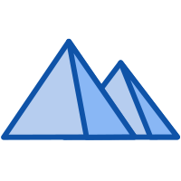

  

杭州融慧科技数据有限公司的项目模板

## 特性

- ⚡️ [pnpm](https://pnpm.io),[vite 3](https://github.com/vitejs/vite),[vue 3](https://github.com/vuejs/core),[ESBuild](https://github.com/evanw/esbuild) - 就是快
- 🍍 [使用 Pinia 的状态管理](https://pinia.vuejs.org)
- 🔥 使用 [新的 `<script setup>` 语法](https://github.com/vuejs/rfcs/pull/227)
- 🤙🏻 默认开启 [响应性语法糖](https://vuejs.org/guide/extras/reactivity-transform.html)
- 🦾 [SpringBoot 2.7.3](https://github.com/spring-projects/spring-boot) - 最先进的 SpringBoot 版本。

## 预配置

### UI框架

- [Ant Design Vue](https://2x.antdv.com/docs/vue/migration-v2-cn) - 提炼自企业级中后台产品的交互语言和视觉风格。

### Icons

- [@ant-design/icons-vue](https://2x.antdv.com/components/icon-cn) - 使用任意的图标。

## 插件

- [MyBatis](https://github.com/mybatis/mybatis-3),[MyBatis plus](https://github.com/baomidou/mybatis-plus) - 自定义 SQL、存储过程以及高级映射的持久层框架。
- [Sa Token](https://github.com/dromara/Sa-Token) - 一个轻量级 Java 权限认证框架，让鉴权变得简单、优雅！
- [Restful Return](https://github.com/elonehoo/restful-return) - 浏览器支持基于 Spring Boot 的返回值类型。
- [Lombok](https://github.com/projectlombok/lombok) - Java 编程语言的非常辛辣的补充。
- [Vue Router](https://github.com/vuejs/router) - Vue.js 的官方路由
- [Pinia](https://github.com/vuejs/pinia) - 直接的, 类型安全的, 使用 Composition api 的轻便灵活的 Vue 状态管理
- [VueUse](https://github.com/vueuse/vueuse) - 实用的 Composition API 工具合集
- [Windicss](https://github.com/windicss/windicss) - 下一代实用程序优先的 CSS 框架。

## License

[GNU Lesser General Public](./LICENSE) License © 2022 杭州融慧科技数据有限公司
